# Lập trình thiết bị di động - Vi Phúc Thịnh - 65133373

---
## Check List
- [Hello World](#hello-world)
- [Tính tổng](#tính-tổng)
- [Tính toán linearlayout](#tính-toán-linear-layout)
- [ListView cơ bản](#listview-cơ-bản)
- [App món ăn](#app-món-ăn)
- [RecyclerView](#recyclerview)
- [Simple Intent](#simple-intent)
- [Static Fragment](#static-fragment)
- [Dynamic Fragment](#dynamic-fragment)
- [Replacing Dynamic Fragment](#replacing-dynamic-fragment)
---

## [Hello World](HelloWorld/app/src/main/)

    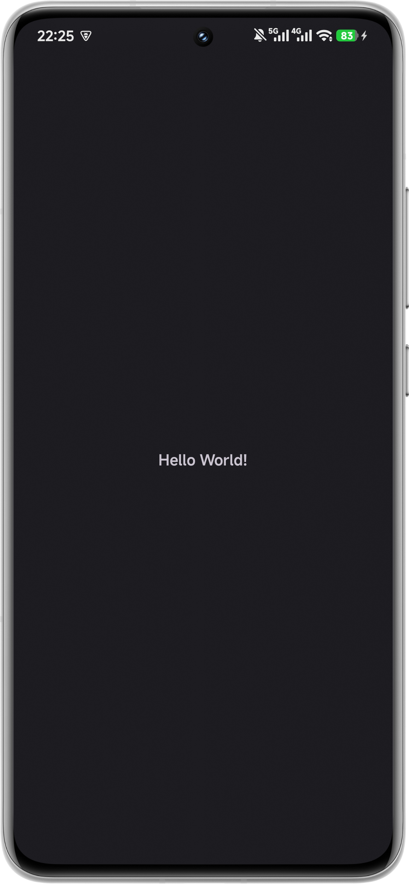

## [Tính tổng](TinhTong/app/src/main/)

    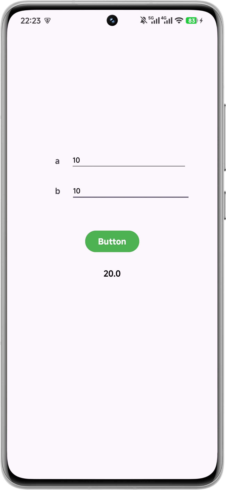

## [Tính Toán (Linear Layout)](TinhToanLinearLayout/app/src/main/)

    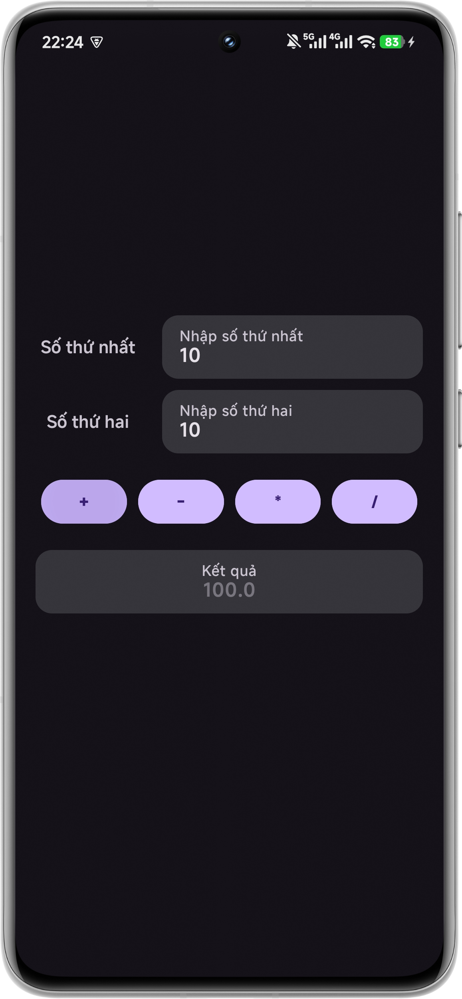

## [ListView cơ bản](TestListView/app/src/main/)

    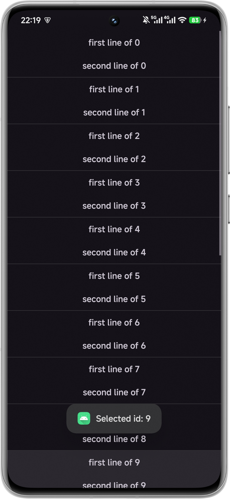

## [App món ăn](AppCom/app/src/main/)

    

## [RecyclerView](RecyclerView/app/src/main/)

    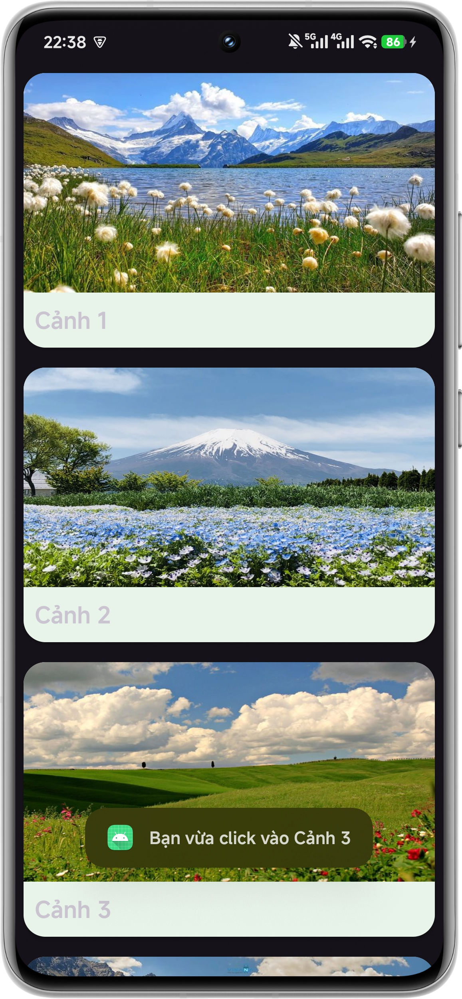

## [Simple Intent](SimpleIntent/app/src/main/)

    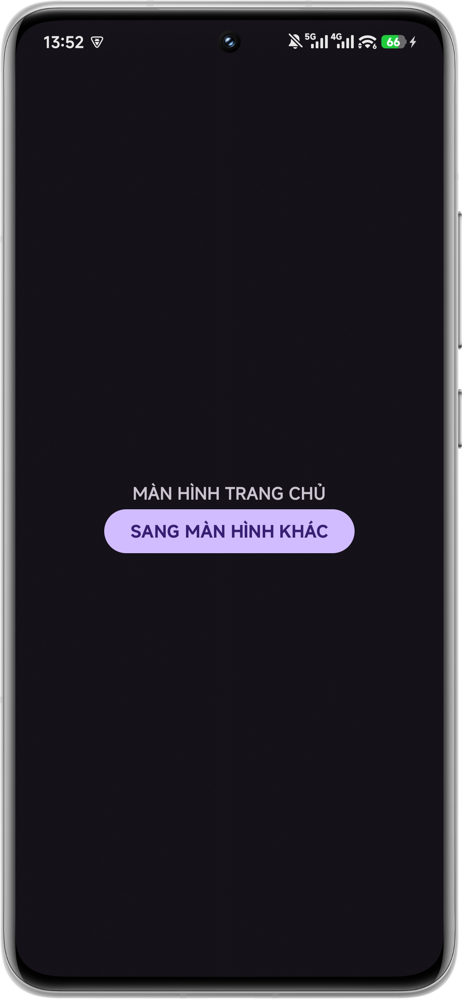
    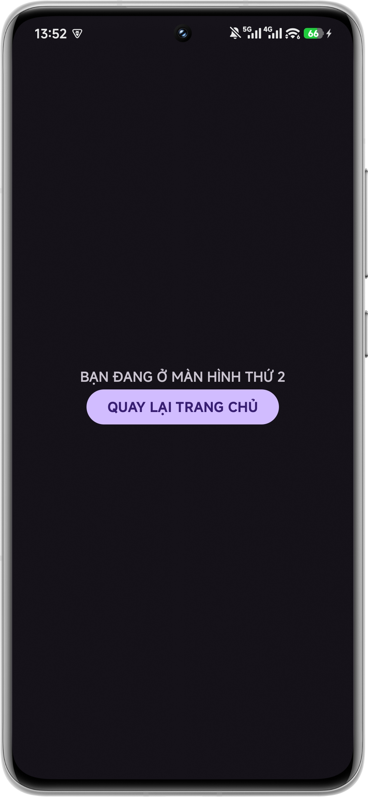

## [Static Fragment](StaticFragment/app/src/main/)

    

## [Dynamic Fragment](DynamicFragment/app/src/main/)

    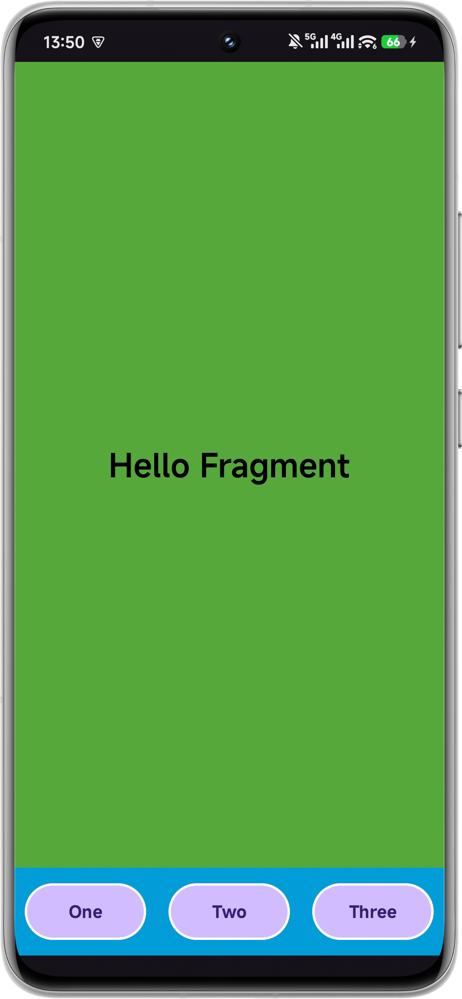

## [Replacing Dynamic Fragment](ReplacingDynamicFragment/app/src/main/)

    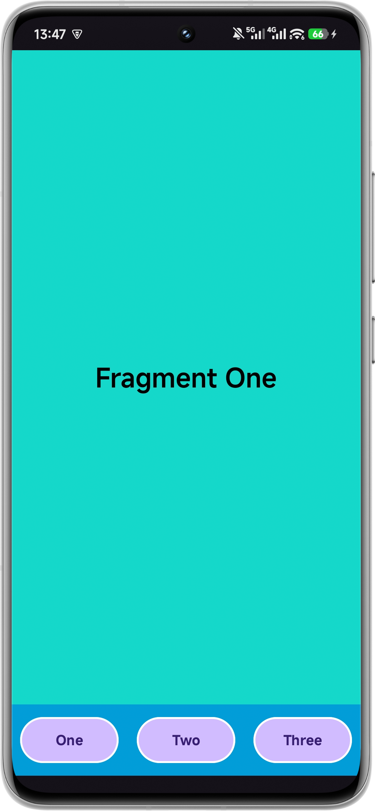
    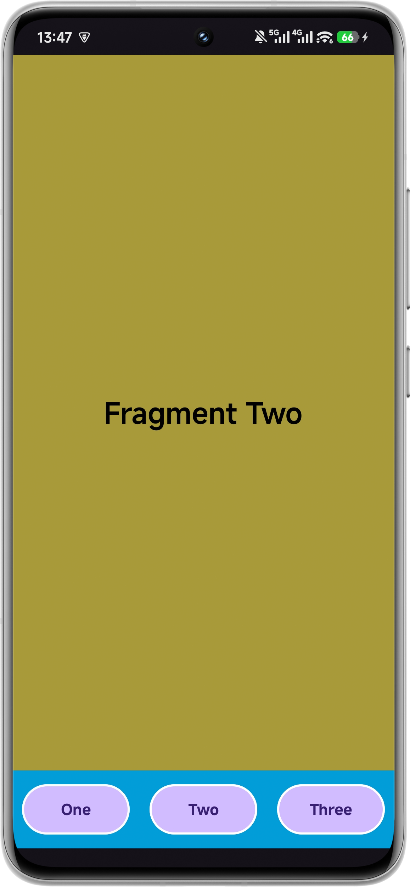
    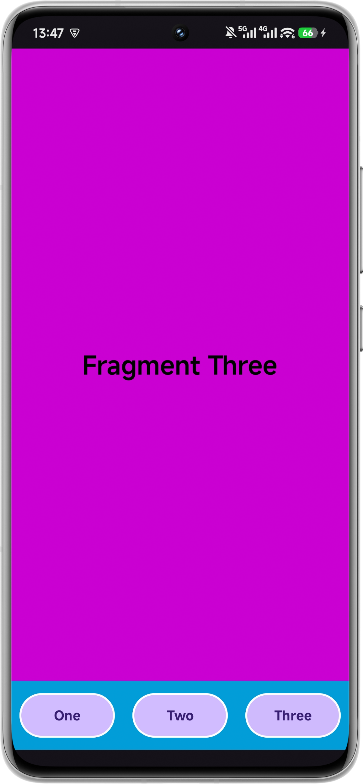

